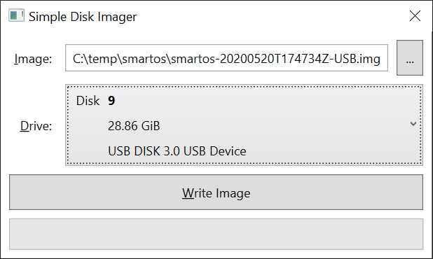

# Simple Disk Imager

The goal of this project is to provide a simple Windows program that write USB
disk images to USB thumb drives.

Unlike
[Win32 Disk Imager](https://sourceforge.net/projects/win32diskimager/),
this program will slightly modify the contents of image before writing.
Specifically,
[GPT partitions headers](https://en.wikipedia.org/wiki/GUID_Partition_Table)
will be updated based on the drive geometry. Additionally the partitioning
information information is only written to the disk after all data has been
written, which prevents Windows from trying to automatically mount the disk
before the imaging is complete.

Unlike
[Rufus](https://rufus.ie/),
this tool will not try to modify an CD ROM image (a.k.a. ISO image) to work
correctly on a USB thumb drive.

## Screenshot

## Supported partition formats

* [Master Boot Record (MBR)](https://en.wikipedia.org/wiki/Master_boot_record)
* [GUID Partition Table (GPT)](https://en.wikipedia.org/wiki/GUID_Partition_Table)

## Supported disk images formats

* Raw
* [Virtual Hard Disk (VHD)](https://en.wikipedia.org/wiki/VHD_(file_format))

The disk image loading code is based on
[ZFS Sharp](https://github.com/AustinWise/ZfsSharp),
so several more formats could be potentially ported over, such as VHDX and VDI.

## TODO

* Figure out thumb drives written by Win32 Disk Imager and Rufus don't work.
  Any advice on how to speed up the cycle from editing code in the bootloader
  to testing it on hardware would be appreciated, as currently it is slow going.
  Also suggestions for diffing disk images would be appreciated.
* Set up automated build and release system.
* Prevent Windows from trying to mount the device by using `FSCTL_LOCK_VOLUME`.
  This is a little difficult as `FSCTL_LOCK_VOLUME` operates on volumes. Zero or
  more volumes can be on each disk.
* Research the difficulty of supporting writing ISO images (non-hybrid) to thumb
  drives. This would enable writing Windows installation media to thumb drives.
* Use custom COM type instead of those generated by TLBIMP.exe. Currently
  several types are marked with `ComConversionLossAttribute`. This blocks
  querying drive letters. There may also be a stack corruption problem with
  `_VDS_ASYNC_OUTPUT`.
* Implement the drive add/remove event on top of the COM interface instead of
  listening for Windows messages. This would make the library easier to use in
  new GUIS.
* Research if there is a way to get a round the apparent single-threaded nature
  of VDS. Currently if there is a "clean all" operation ongoing, every query to
  VDS blocks.
* Gracefully handle errors during device enumeration. Currently if a device is
  stuck in "clean all", pulling out the device will result in an exception in
  blocked call to `IEnumVdsObject.Next`.
* Use something like ILMerge to create a single file executable.
* Consider using a system like MVVM to move the GUI logic out of the GUI itself.
* Consider supporting operating systems other than Windows.
